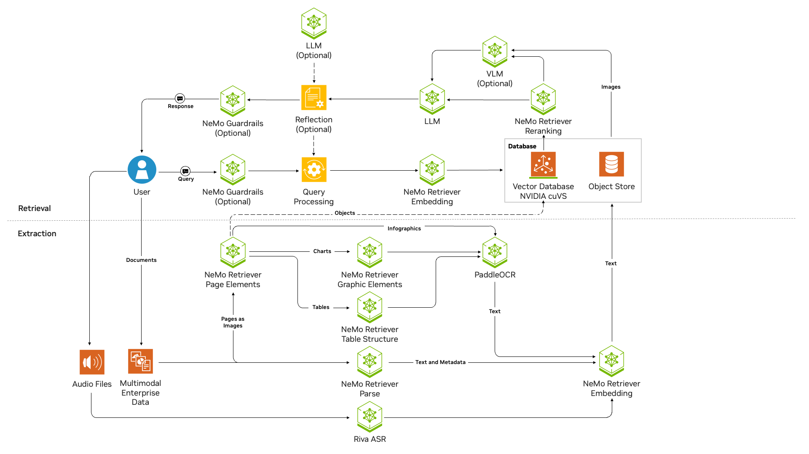

<h1>NVIDIA RAG Blueprint</h1>

Use this documentation to learn about the NVIDIA RAG Blueprint.
The target audience for this blueprint is
developers who want a quick start to set up a RAG solution with a path-to-production with the NVIDIA NIM.
For the prerequisites for this blueprint, see [Minimum System Requirements](/docs/support-matrix.md).

## Overview

The NVIDIA RAG blueprint serves as a reference solution for a foundational Retrieval Augmented Generation (RAG) pipeline.
One of the key use cases in Generative AI is enabling users to ask questions and receive answers based on their enterprise data corpus.
This blueprint demonstrates how to set up a RAG solution that uses NVIDIA NIM and GPU-accelerated components.
By default, this blueprint leverages locally-deployed NVIDIA NIM microservices to meet specific data governance and latency requirements.
However, you can replace these models with your NVIDIA-hosted models available in the [NVIDIA API Catalog](https://build.nvidia.com).

### Key Features
- Multimodal PDF data extraction support with text, tables, charts, and infographics
- Support for audio file ingestion
- Native Python library support
- Custom metadata support
- Multi-collection searchability
- Opt-in for Vision Language Model (VLM) Support in the answer generation pipeline.
- Document summarization
- Hybrid search with dense and sparse search
- Opt-in image captioning with vision language models (VLMs)
- Reranking to further improve accuracy
- GPU-accelerated Index creation and search
- Multi-turn conversations
- Multi-session support
- Telemetry and observability
- Improve accuracy with optional reflection
- Improve content safety with an optional programmable guardrails to
- Sample user interface
- OpenAI-compatible APIs
- Decomposable and customizable

### Software Components

The following are the default components included in this blueprint:

* NVIDIA NIM Microservices
   * Response Generation (Inference)
      * [NIM of nvidia/llama-3.3-nemotron-super-49b-v1](https://build.nvidia.com/nvidia/llama-3_3-nemotron-super-49b-v1)
    * Retriever Models
      * [NIM of nvidia/llama-3_2-nv-embedqa-1b-v2]( https://build.nvidia.com/nvidia/llama-3_2-nv-embedqa-1b-v2)
      * [NIM of nvidia/llama-3_2-nv-rerankqa-1b-v2](https://build.nvidia.com/nvidia/llama-3_2-nv-rerankqa-1b-v2)
      * [NeMo Retriever Page Elements NIM](https://build.nvidia.com/nvidia/nemoretriever-page-elements-v2)
      * [NeMo Retriever Table Structure NIM](https://build.nvidia.com/nvidia/nemoretriever-table-structure-v1)
      * [NeMo Retriever Graphic Elements NIM](https://build.nvidia.com/nvidia/nemoretriever-graphic-elements-v1)
      * [PaddleOCR NIM](https://build.nvidia.com/baidu/paddleocr)

  * Optional NIMs

    * [Llama 3.1 NemoGuard 8B Content Safety NIM](https://build.nvidia.com/nvidia/llama-3_1-nemoguard-8b-content-safety)
    * [Llama 3.1 NemoGuard 8B Topic Control NIM](https://build.nvidia.com/nvidia/llama-3_1-nemoguard-8b-topic-control)
    * [Mixtral 8x22B Instruct 0.1](https://build.nvidia.com/mistralai/mixtral-8x22b-instruct)
    * [Llama-3.1 Nemotron-nano-vl-8b-v1 NIM](https://build.nvidia.com/nvidia/llama-3.1-nemotron-nano-vl-8b-v1)
    * [NeMo Retriever Parse NIM](https://build.nvidia.com/nvidia/nemoretriever-parse)

* RAG Orchestrator server - Langchain based
* Milvus Vector Database - accelerated with NVIDIA cuVS
* Ingestion - [Nemo Retriever Extraction](https://github.com/NVIDIA/nv-ingest/tree/main) is leveraged for ingestion of files. Nemo Retriever Extraction is a scalable, performance-oriented document content and metadata extraction microservice. Including support for parsing PDFs, Word and PowerPoint documents, it uses specialized NVIDIA NIM microservices to find, contextualize, and extract text, tables, charts and images for use in downstream generative applications.
* File Types: File types supported by Nemo Retriever Extraction are supported by this blueprint. This includes `.pdf`, `.pptx`, `.docx` having images. Image captioning support is turned off by default to improve latency, so questions about images in documents will yield poor accuracy. For the full list of supported file types, see [What is NeMo Retriever Extraction?](https://docs.nvidia.com/nemo/retriever/extraction/overview/)

We provide Docker Compose scripts that deploy the microservices on a single node.
Alternatively, developers can launch this blueprint directly in an [NVIDIA AI Workbench](https://www.nvidia.com/en-us/deep-learning-ai/solutions/data-science/workbench/) developer environment.
When you are ready for a large-scale deployment,
you can use the included Helm charts to deploy the necessary microservices.
You use sample Jupyter notebooks with the JupyterLab service to interact with the code directly.

The Blueprint contains sample data from the [NVIDIA Developer Blog](https://github.com/NVIDIA-AI-Blueprints/rag/blob/main/data/dataset.zip) and also some [sample multimodal data](./data/multimodal/).
You can build on this blueprint by customizing the RAG application to your specific use case.

We also provide a sample user interface named `rag-playground`.

### Technical Diagram

  

  
  

The image represents the architecture and workflow. Here's a step-by-step explanation of the workflow from end-user perspective:

1. **User Interaction via RAG Playground or APIs**:
   - The user interacts with this blueprint by typing queries into the sample UI microservice named as **RAG Playground**. These queries are sent to the system through the `POST /generate` API exposed by the RAG server microservice. There are separate [notebooks](./notebooks/) available which showcase API usage as well.

2. **Query Processing**:
   - The query enters the **RAG Server**, which is based on LangChain. An optional **Query Rewriter** component may refine or decontextualize the query for better retrieval results at this stage. An optional NeMoGuardrails component can be enabled as well to help filter out queries at input of the pipeline.

3. **Retrieval of Relevant Documents**:
   - The refined query is passed to the **Retriever** module of the **RAG Server microservice**. This component queries the **Milvus Vector Database microservice**, which stores embeddings of the data, generated using **NeMo Retriever Embedding microservice**. The retriever module identifies the top K most relevant chunks of information related to the query.

4. **Reranking for Precision**:
   - The top K chunks are passed to the optional **NeMo Retriever reranking microservice**. The reranker narrows down the results to the top N most relevant chunks, improving precision.

5. **Response Generation**:
   - The top N chunks are injected in the prompt and sent to the **Response Generation** module, which leverages **NeMo LLM inference Microservice** to generate a natural language response based on the retrieved information. Optionally, a reflection module can be enabled which makes additional LLM calls to improve the response by verifying its groundness based on retrieved context at this stage. NeMo guardrails can also be enabled at this stage to guardrail the output against toxicity.

6. **Delivery of Response**:
   - The generated response is sent back to the **RAG Playground**, where the user can view the answer to their query as well as check the output of the retriever module using the `Citations` option.

7. **Ingestion of Data**:
   - Separately, unstructured data is ingested into the system via the `POST /documents` API using the **Ingestor server microservice**. This data is preprocessed, split into chunks and stored in the **Milvus Vector Database** using **Nvingest microservice** which is called from the ingestor microservice.

This modular design ensures efficient query processing, accurate retrieval of information, and easy customization.

## Get Started With NVIDIA RAG Blueprint

| :exclamation: Important |
| :-----------------------|
| Users running this blueprint with [NVIDIA AI Workbench](https://www.nvidia.com/en-us/deep-learning-ai/solutions/data-science/workbench/) should skip to the quickstart section [here](deploy/workbench/README.md#get-started)! |

To get started with the NVIDIA RAG Blueprint, do the following:

- Use the procedures in [Get Started](./docs/quickstart.md) to deploy this blueprint.
- See the [OpenAPI Specifications](./docs/api_reference).
- Explore the notebooks that demonstrate how to use the APIs [here](./notebooks/).
- Learn how to [Use the NVIDIA RAG Python Package](docs/python-client.md).

If you are interested in MIG support, see [Helm Deployment with MIG Support](docs/mig-deployment.md).

To migrate from a previous version, see the [migration guide](./docs/migration_guide.md).

## Developer Guide

After you deploy the RAG blueprint, you can customize it for your use cases.

The following are some of the customizations that you can make to the blueprint:

- [Change the Inference or Embedding Model](docs/change-model.md)
- [Customize LLM Parameters at Runtime](docs/llm-params.md)
- [Customize Multi-Turn Conversations](docs/multiturn.md)
- [Customize Prompts](docs/prompt-customization.md)
- [Milvus Configuration](docs/milvus-configuration.md)
- [Add custom metadata to files](docs/custom-metadata.md)

The following are some of the features that you can enable:

- [Enable audio ingestion support](docs/audio_ingestion.md)
- [Enable hybrid search](docs/hybrid_search.md)
- [Enable image captioning support for ingested documents](docs/image_captioning.md)
- [Enable multi-collection retrieval](docs/multi-collection-retrieval.md)
- [Enable NeMo Guardrails for guardrails at input/output](docs/nemo-guardrails.md)
- [Enable observability support](./docs/observability.md)
- [Enable PDF extraction with Nemoretriever Parse](docs/nemoretriever-parse-extraction.md)
- [Enable standalone NV-Ingest for direct document ingestion without ingestor server](docs/nv-ingest-standalone.md)
- [Enable query rewriting to improve the accuracy of multi-turn conversations](docs/query_rewriter.md)
- [Enable reasoning in Nemotron model](docs/enable-nemotron-thinking.md)
- [Enable self-reflection to improve accuracy](docs/self-reflection.md)
- [Enabling Summarization](docs/summarization.md)
- [Enable text-only ingestion of files](docs/text_only_ingest.md)
- [Enable VLM based inferencing in RAG](docs/vlm.md)

To fine-tune RAG performance, see [Best practices for common settings](./docs/accuracy_perf.md).

To troubleshoot issues that arise when you work with the NVIDIA RAG Blueprint, see [Troubleshoot](docs/troubleshooting.md).

> **⚠️ Important B200 Limitation Notice:**
>
> B200 GPUs are **not supported** for the following advanced features:
> - Self-Reflection to improve accuracy
> - Query rewriting to Improve accuracy of Multi-Turn Conversations
> - Image captioning support for ingested documents
> - NeMo Guardrails for guardrails at input/output
> - VLM based inferencing in RAG
> - PDF extraction with Nemoretriever Parse
>
> For these features, please use H100 or A100 GPUs instead.

## Inviting the community to contribute

We're posting these examples on GitHub to support the NVIDIA LLM community and facilitate feedback.
We invite contributions!
To open a GitHub issue or pull request, see the [contributing guidelines](./CONTRIBUTING.md).

## License

This NVIDIA AI BLUEPRINT is licensed under the [Apache License, Version 2.0.](./LICENSE) This project will download and install additional third-party open source software projects and containers. Review [the license terms of these open source projects](./LICENSE-3rd-party.txt) before use.

Use of the models in this blueprint is governed by the [NVIDIA AI Foundation Models Community License](https://docs.nvidia.com/ai-foundation-models-community-license.pdf).

## Terms of Use
This blueprint is governed by the [NVIDIA Agreements | Enterprise Software | NVIDIA Software License Agreement](https://www.nvidia.com/en-us/agreements/enterprise-software/nvidia-software-license-agreement/) and the [NVIDIA Agreements | Enterprise Software | Product Specific Terms for AI Product](https://www.nvidia.com/en-us/agreements/enterprise-software/product-specific-terms-for-ai-products/). The models are governed by the [NVIDIA Agreements | Enterprise Software | NVIDIA Community Model License](https://www.nvidia.com/en-us/agreements/enterprise-software/nvidia-community-models-license/) and the [NVIDIA RAG dataset](https://github.com/NVIDIA-AI-Blueprints/rag/tree/v2.0.0/data/multimodal) which is governed by the [NVIDIA Asset License Agreement](https://github.com/NVIDIA-AI-Blueprints/rag/blob/main/data/LICENSE.DATA).

The following models that are built with Llama are governed by the [Llama 3.2 Community License Agreement](https://www.llama.com/llama3_2/license/): llama-3.3-nemotron-super-49b-v1, nvidia/llama-3.2-nv-embedqa-1b-v2, and nvidia/llama-3.2-nv-rerankqa-1b-v2.

